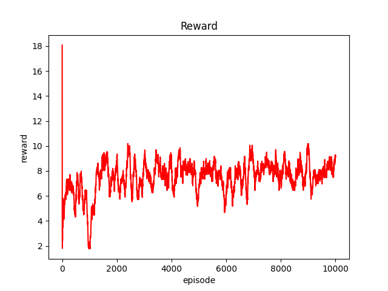
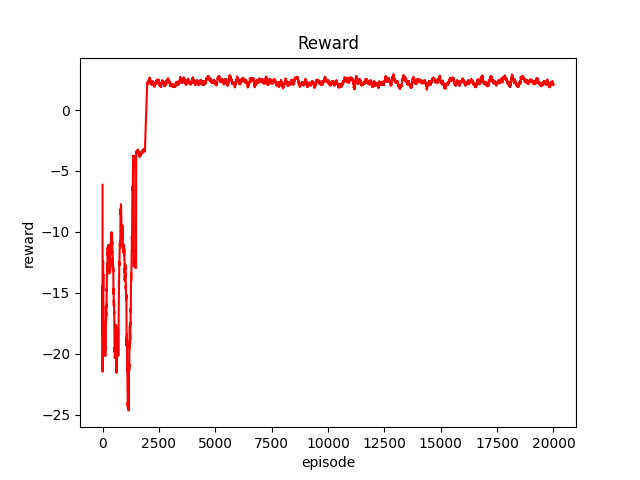
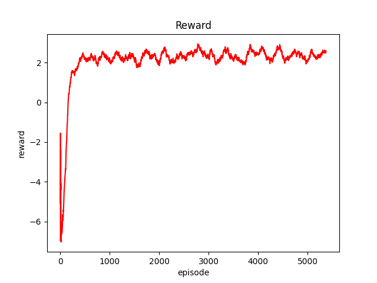
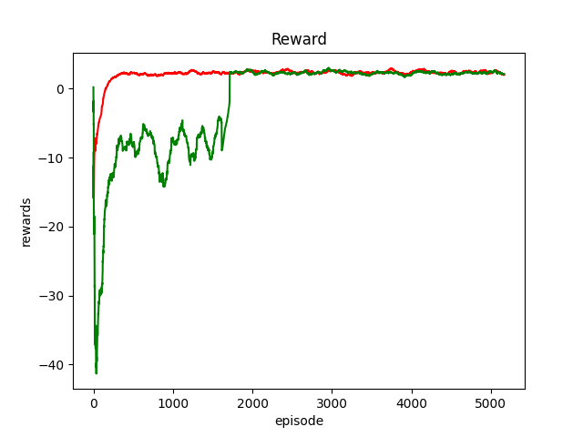

# Deep Reinforce Learning Algorithm with Blockchain Scaling
This is a graduation project implemention, in which we give 2 optimization models, namely Double DQN and PPO based on previous work. We also define the environment for DRL in "./eth_optimize.py".
## DRL Env
we focus on optimize the tps and latency of ethereum (clque network) with DRL. So we first clearify the base information of this RL env as in "./eth_optimize.py".
More details are written in "Double-DQN/ethOptimize.ipynb"
To use our env, you can call code as followed.
```
from eth_optimize import EthOptimize
env = EthOptimize()
```
## DRL model implemention
### 1. DQN
in "myDQN.py" we simply build a DQN model and validate it with env=gym.make("lunar-landerv2") which shows a nice result. Then comes to DDQN
### 2. Double DQN
in "DDQN.py",we gives the DDQN model and we use it in our env and get a reward convergence.
in our env, 2 reward function are displayed. one is simple and the other is complex. both func shows a nice result.
for simple one, EP10000 and EP20000 results are down beneath.  

<div align=center></div> 
<div></div>
<div align=center></div>  

### 3. PPO(Proximal Policy Optimization)
in "PPO.py" gives a PPO model on discrete action space. To train PPO we use "trainPPO.py", and also get a great result.

<div align=center></div> 

### Compare
To compare the model we use, we also use "trainBoth.py" to plot rewards comparison in 1 pic.
<div align=center></div> 
green one is DDQN and red one is PPO. Clearly PPO has a faster convergence speed than DDQN, showing its better performance in our env.

## The project is still in progress. To be continued.
@copyright: Ryan Bq zhao  
@author: ryanhigh  
contact me: ryanbqzhao@gmail.com