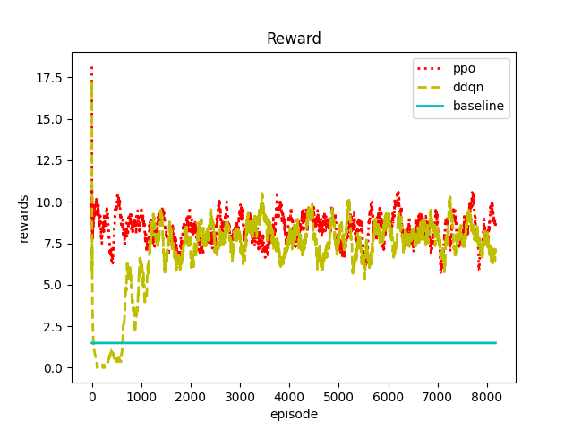

# Deep Reinforce Learning Algorithm with Blockchain Scaling
This is a graduation project implementation, in which we give 2 optimization models, namely Double DQN and PPO based on previous work. We also define the environment for DRL in "./eth_optimize.py".
## DRL Env
we focus on optimize the tps and latency of ethereum (clque network) with DRL. So we first clearify the base information of this RL env as in ``eth_optimize.py``.
More details are written in ``ethOptimize.ipynb``
To use our env, you can call code as followed.
```
from eth_optimize import EthOptimize
env = EthOptimize()
```
## DRL model implementation
### 1. DQN
in ``myDQN.py`` we simply build a DQN model and validate it with ``env=gym.make("lunar-landerv2")`` which shows a nice result. Then comes to DDQN
### 2. Double DQN
in ``DDQN.py``,we gives the DDQN model and we use it in our env and get a reward convergence.
in our env, 2 reward functions are displayed. one is simple and the other is complex. both func shows a nice result.
for simple one, EP10000 and EP20000 results are down beneath.  

<div align=center></div> 
<div></div>
<div align=center></div>  
for a complex one, EP20000 is showed.
<div align=center></div>  

### 3. PPO(Proximal Policy Optimization)
in ``PPO.py`` gives a PPO model on discrete action space. To train PPO we use ``trainPPO.py``, and also get a great result.

<div align=center></div> 

## Compare
To compare the model we use, we also use ``trainBoth.py`` to plot rewards comparison in 1 pic.
<div align=center></div> 
green one is DDQN and red one is PPO. Clearly PPO has a faster convergence speed than DDQN, showing its better performance in our env.

## Validate
### 1. reward figure
we introduce the baseline of a system (w/o any DRL algorithm), and we compare the rewards of 3 pots. For complex one, the fig as
<div align=center></div> 
Simply shows that our model has a positive influence on system.   

### 2. evaluation
To validate that our models do have a optimization trend, we use simple reward function as **Evaluation Criteria** and here is the result.
<div align=center></div> 
<div align=center>loose constraint</div>
<div align=center></div> 
<div align=center>tight constraint</div>

further evaluation criteria analysis in ``eval_criteria_analyse.py``. In this part, we assume that everything have been done and get a csv file storing data. Than we utilize these data plot and analyse.  

#### What can be done?
* smooth the curve with ``colve`` func.
for example, we first take windowsize as 500, and result is below
<div align=center></div> 

* test the convergence value of each model, and calculate the optimization percentage.
we show the convergence level in pic below. ppo gives a 27.76% higher and ddqn gives 16.84% higher.
<div align=center></div> 

## The project is still in progress. To be continued.
@copyright: Ryan Bq zhao  
@author: ryanhigh  
contact me: ryanbqzhao@gmail.com